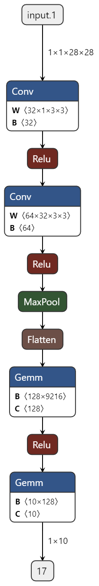

# MNIST手写字符分类-卷积

[TOC]

&emsp;&emsp;在上一篇中，我们介绍了如何在pytorch中使用线性层+ReLU非线性层堆叠的网络进行手写字符识别的网络构建、训练、模型保存、导出和推理测试。本篇文章中，我们将要使用卷积层进行网络构建，并完成后续的训练、保存、导出，并使用opencv在C++中推理我们的模型，将结果可视化。

## 1 模型构造

&emsp;&emsp;在pytorch中，卷积层的使用比较方便，需要注意的是卷积层的输入通道数、输出通道数、卷积核的大小等参数。这里直接放出构建的网络结构：

```python
import torch
from torch import nn
from torch.utils.data import DataLoader
class ZKNNNet_Conv(nn.Module):
    def __init__(self):
        super(ZKNNNet_Conv, self).__init__()
        self.conv_stack = nn.Sequential(
            nn.Conv2d(1, 32, kernel_size=3),
            nn.ReLU(),
            nn.Conv2d(32, 64, kernel_size=3),
            nn.ReLU(),
            nn.MaxPool2d(kernel_size=2),
            nn.Flatten(),
            nn.Linear(12*12*64, 128),
            nn.ReLU(),
            nn.Linear(128, 10)
        )

    def forward(self, x):
        logits = self.conv_stack(x)
        return logits
```



从图中可以看出，该模型先堆叠了两个卷积层与ReLU单元，经过最大池化之后，展开并进行后续的全连接层训练。

## 2 训练

```python
import torch
from torch import nn
from torch.utils.data import DataLoader
from torchvision import datasets
from torchvision.transforms import ToTensor, Lambda, Compose
from ZKNNNet import ZKNNNet_Conv
import os
# Download training data from open datasets.
training_data = datasets.MNIST(
    root="data",
    train=True,
    download=True,
    transform=ToTensor(),
)

# Download test data from open datasets.
test_data = datasets.MNIST(
    root="data",
    train=False,
    download=True,
    transform=ToTensor(),
)

# Create data loaders.
train_dataloader = DataLoader(training_data, batch_size=64)
test_dataloader = DataLoader(test_data, batch_size=64)

# Get cpu or gpu device for training.
device = "cuda" if torch.cuda.is_available() else "cpu"
print("Using {} device".format(device))

model = ZKNNNet_Conv()
if os.path.exists("./model/model_conv.pth"):
    model.load_state_dict(torch.load("./model/model_conv.pth"))
model = model.to(device)
print(model)

# Optimizer
optimizer = torch.optim.SGD(model.parameters(), lr=1e-3)

# Loss function
loss_fn = nn.CrossEntropyLoss()

# Train
def train(dataloader, model, loss_fn, optimizer):
    size = len(dataloader.dataset)
    model.train()
    for batch, (X, y) in enumerate(dataloader):
        X, y = X.to(device), y.to(device)

        # Compute prediction error
        pred = model(X)
        loss = loss_fn(pred, y)

        # Backpropagation
        optimizer.zero_grad()
        loss.backward()
        optimizer.step()

        if batch % 100 == 0:
            loss, current = loss.item(), batch * len(X)
            print(f"loss: {loss:>7f}  [{current:>5d}/{size:>5d}]")

# Test
def test(dataloader, model):
    size = len(dataloader.dataset)
    model.eval()
    test_loss, correct = 0, 0
    with torch.no_grad():
        for X, y in dataloader:
            X, y = X.to(device), y.to(device)
            pred = model(X)
            test_loss += loss_fn(pred, y).item()
            correct += (pred.argmax(1) == y).type(torch.float).sum().item()
    test_loss /= size
    correct /= size
    print(f"Test Error: \n Accuracy: {(100*correct):>0.1f}%, Avg loss: {test_loss:>8f} \n")
    return correct

epochs = 200
maxAcc = 0
for t in range(epochs):
    print(f"Epoch {t+1}\n-------------------------------")
    train(train_dataloader, model, loss_fn, optimizer)
    currentAcc = test(test_dataloader, model)
    if maxAcc < currentAcc:
        maxAcc = currentAcc
        torch.save(model.state_dict(), "./model/model_conv.pth")
print("Done!")
```

模型的训练代码与上一篇中的线性连接训练代码是一样的。
训练过程来看，使用卷积层，在相同数据集上训练，模型收敛速度比用线性层快很多。最终精度达到97.8%。

## 3 推理

模型训练完成之后，推理过程与上一篇一致，这里简单放一下推理代码。

```python
import torch
from torch import nn
from torch.utils.data import DataLoader
from torchvision.transforms import ToTensor
from torchvision import datasets
from ZKNNNet import ZKNNNet_Conv

import matplotlib.pyplot as plt

# Get cpu or gpu device for inference.
device = "cuda" if torch.cuda.is_available() else "cpu"
print("Using {} device for inference".format(device))

# Load the trained model
model = ZKNNNet_Conv()
model.load_state_dict(torch.load("./model/model_conv.pth"))
model.to(device)
model.eval()

# Download test data from open datasets.
test_data = datasets.MNIST(
    root="data",
    train=False,
    download=True,
    transform=ToTensor(),
)

# Create data loader.
test_dataloader = DataLoader(test_data, batch_size=64)


# Perform inference
with torch.no_grad():
    correct = 0
    total = 0
    for images, labels in test_dataloader:
        images = images.to(device)
        labels = labels.to(device)
        outputs = model(images)
        _, predicted = torch.max(outputs.data, 1)
        total += labels.size(0)
        correct += (predicted == labels).sum().item()

        # Visualize the image and its predicted result
        for i in range(len(images)):
            image = images[i].cpu()
            label = labels[i].cpu()
            prediction = predicted[i].cpu()

            plt.imshow(image.squeeze(), cmap='gray')
            plt.title(f"Label: {label}, Predicted: {prediction}")
            plt.show()

    accuracy = 100 * correct / total
    print("Accuracy on test set: {:.2f}%".format(accuracy))
```

## 4 导出

模型导出方式与上一篇一致。

```python
import torch
import torch.utils
import os
from ZKNNNet import ZKNNNet_3Layer,ZKNNNet_5Layer,ZKNNNet_Conv
model_conv = ZKNNNet_Conv()
if os.path.exists('./model/model_conv.pth'):
    model_conv.load_state_dict(torch.load('./model/model_conv.pth'))
model_conv = model_conv.to(device)
model_conv.eval()
torch.onnx.export(model_conv,torch.randn(1,1,28,28),'./model/model_conv.onnx',verbose=True)
```

## 5 onnx测试

```python
import onnxruntime as rt
import numpy as np
import torch
from torch import nn
from torch.utils.data import DataLoader
from torchvision.transforms import ToTensor
from torchvision import datasets

import matplotlib.pyplot as plt

from PIL import Image

sess = rt.InferenceSession("model/model_conv.onnx")
input_name = sess.get_inputs()[0].name
print(input_name)

image = Image.open('./data/test/2.png')
image_data = np.array(image)
image_data = image_data.astype(np.float32)/255.0
image_data = image_data[None,None,:,:]
print(image_data.shape)

outputs = sess.run(None,{input_name:image_data})
outputs = np.array(outputs).flatten()

prediction = np.argmax(outputs)
plt.imshow(image, cmap='gray')
plt.title(f"Predicted: {prediction}")
plt.show()

# Download test data from open datasets.
test_data = datasets.MNIST(
    root="data",
    train=False,
    download=True,
    transform=ToTensor(),
)

# Create data loader.
test_dataloader = DataLoader(test_data, batch_size=1)

with torch.no_grad():
    correct = 0
    total = 0
    for images, labels in test_dataloader:
        images = images.numpy()
        labels = labels.numpy()
        outputs = sess.run(None,{input_name:images})[0]
        outputs = np.array(outputs).flatten()
        prediction = np.argmax(outputs)

        # Visualize the image and its predicted result
        for i in range(len(images)):
            image = images[i]
            label = labels[i]

            plt.imshow(image.squeeze(), cmap='gray')
            plt.title(f"Label: {label}, Predicted: {prediction}")
            plt.show()
```

至此，模型已经成功的转换成onnx模型，可以用于后续各种部署环境的部署。

## 6 opencv部署

本例中，使用C++/opencv来尝试部署刚才训练的模型。输入为在之前的博文中提到的将MNIST测试集导出成png图片保存。

```C++
#include "opencv2/opencv.hpp"

#include <iostream>
#include <filesystem>
#include <string>
#include <vector>

int main(int argc, char** argv)
{
    if (argc != 3)
    {
        std::cerr << "Usage: MNISTClassifier_onnx_opencv <onnx_model_path> <image_path>" << std::endl;
        return 1;
    }

    cv::dnn::Net net = cv::dnn::readNetFromONNX(argv[1]);
    if (net.empty())
    {
        std::cout << "Error: Failed to load ONNX file." << std::endl;
        return 1;
    }
    std::filesystem::path srcPath(argv[2]);

    for (auto& imgPath : std::filesystem::recursive_directory_iterator(srcPath))
    {
        if(!std::filesystem::is_regular_file(imgPath))
            continue;

        const cv::Mat image = cv::imread(imgPath.path().string(), cv::IMREAD_GRAYSCALE);
        if (image.empty())
        {
            std::cerr << "Error: Failed to read image file." << std::endl;
            continue;
        }

        const cv::Size size(28, 28);
        cv::Mat resized_image;
        cv::resize(image, resized_image, size);

        cv::Mat float_image;
        resized_image.convertTo(float_image, CV_32F, 1.0 / 255.0);

        cv::Mat input_blob = cv::dnn::blobFromImage(float_image);
        
        net.setInput(input_blob);
        cv::Mat output = net.forward();

        cv::Point classIdPoint;
        double confidence;
        cv::minMaxLoc(output.reshape(1, 1), nullptr, &confidence, nullptr, &classIdPoint);
        const int class_id = classIdPoint.x;

        std::cout << "Class ID: " << class_id << std::endl;
        std::cout << "Confidence: " << confidence << std::endl;
        cv::Mat bigImg;
        cv::resize(image,bigImg,cv::Size(128,128));
        auto parentPath = imgPath.path().parent_path();
        auto label = parentPath.filename().string()+std::string("<->")+std::to_string(class_id);
        cv::putText(bigImg, label, cv::Point(10, 20), cv::FONT_HERSHEY_SIMPLEX, 0.5, cv::Scalar(255, 255, 255), 1);
        cv::imshow("img",bigImg);
        cv::waitKey();
    }

    return 0;
}

```

本部署方式需要依赖opencv dnn模块。试验中使用的是opencv4.8版本。

## 7 总结

使用卷积神经网络进行MNIST手写字符识别，在模型结构无明显复杂的情况下，模型收敛速度较全连接层构建的网络收敛速度快。

按照相同的套路导出成onnx模型之后，直接通过opencv可以部署，简化深度学习算法部署的难度。

