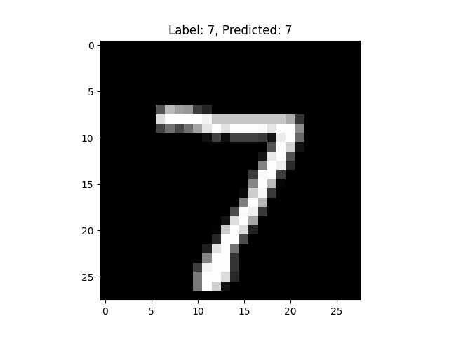

# MNIST手写字符分类

[toc]

## 1 数据集

&emsp;&emsp;MNIST手写字符集包括60000张用于训练的训练集图片和10000张用于测试的测试集图片，所有图片均归一化为28*28的灰度图像。其中字符区域为白色，非字符区域为黑色。
&emsp;&emsp;该数据集可以直接通过pytorch dataset进行下载。

## 2 模型构建

&emsp;&emsp;本次试验采用图像分类的方案进行手写字符分类。分类网络采用线性层->非线性函数堆叠的方式实现。本次试验设计了两个网络，分别是3层网络模型以及4层网络模型。

&emsp;&emsp;模型定义如下：

```python
import torch
from torch import nn
from torch.utils.data import DataLoader

class ZKNNNet_3Layer(nn.Module):
    def __init__(self):
        super(ZKNNNet_3Layer, self).__init__()
        self.flatten = nn.Flatten()
        self.linear_relu_stack = nn.Sequential(
            nn.Linear(28*28, 512),
            nn.ReLU(),
            nn.Linear(512, 512),
            nn.ReLU(),
            nn.Linear(512, 10)
        )

    def forward(self, x):
        x = self.flatten(x)
        logits = self.linear_relu_stack(x)
        return logits

class ZKNNNet_5Layer(nn.Module):
    def __init__(self):
        super(ZKNNNet_5Layer, self).__init__()
        self.flatten = nn.Flatten()
        self.linear_relu_stack = nn.Sequential(
            nn.Linear(28*28, 512),
            nn.ReLU(),
            nn.Linear(512, 512),
            nn.ReLU(),
            nn.Linear(512, 512),
            nn.ReLU(),
            nn.Linear(512, 512),
            nn.ReLU(),
            nn.Linear(512, 10)
        )

    def forward(self, x):
        x = self.flatten(x)
        logits = self.linear_relu_stack(x)
        return logits

```

## 3 训练

&emsp;&emsp;模型训练过程主要包括确定数据集、构建dataloader、确定训练设备(device)、生成模型对象、定义优化器、定义目标函数、设定模型为训练模式、获取输入与标签、进行模型推理、计算损失函数、优化器梯度清零、损失反向传播、优化器步进等。

&emsp;&emsp;训练代码如下：

```python
import torch
from torch import nn
from torch.utils.data import DataLoader
from torchvision import datasets
from torchvision.transforms import ToTensor, Lambda, Compose
from ZKNNNet import ZKNNNet_3Layer, ZKNNNet_5Layer
import os

# Download training data from open datasets.
training_data = datasets.MNIST(
    root="data",
    train=True,
    download=True,
    transform=ToTensor(),
)

# Download test data from open datasets.
test_data = datasets.MNIST(
    root="data",
    train=False,
    download=True,
    transform=ToTensor(),
)

# Create data loaders.
train_dataloader = DataLoader(training_data, batch_size=64)
test_dataloader = DataLoader(test_data, batch_size=64)

# Get cpu or gpu device for training.
device = "cuda" if torch.cuda.is_available() else "cpu"
print("Using {} device".format(device))

model = ZKNNNet_3Layer()
if os.path.exists("model/model_3layer.pth"):
    model.load_state_dict(torch.load("model/model_3layer.pth"))
model = model.to(device)
print(model)

# Optimizer
optimizer = torch.optim.SGD(model.parameters(), lr=1e-3)

# Loss function
loss_fn = nn.CrossEntropyLoss()

# Train
def train(dataloader, model, loss_fn, optimizer):
    size = len(dataloader.dataset)
    model.train()
    for batch, (X, y) in enumerate(dataloader):
        X, y = X.to(device), y.to(device)

        # Compute prediction error
        pred = model(X)
        loss = loss_fn(pred, y)

        # Backpropagation
        optimizer.zero_grad()
        loss.backward()
        optimizer.step()

        if batch % 100 == 0:
            loss, current = loss.item(), batch * len(X)
            print(f"loss: {loss:>7f}  [{current:>5d}/{size:>5d}]")

# Test
def test(dataloader, model):
    size = len(dataloader.dataset)
    model.eval()
    test_loss, correct = 0, 0
    with torch.no_grad():
        for X, y in dataloader:
            X, y = X.to(device), y.to(device)
            pred = model(X)
            test_loss += loss_fn(pred, y).item()
            correct += (pred.argmax(1) == y).type(torch.float).sum().item()
    test_loss /= size
    correct /= size
    print(f"Test Error: \n Accuracy: {(100*correct):>0.1f}%, Avg loss: {test_loss:>8f} \n")
    return correct

epochs = 200
maxAcc = 0
for t in range(epochs):
    print(f"Epoch {t+1}\n-------------------------------")
    train(train_dataloader, model, loss_fn, optimizer)
    currentAcc = test(test_dataloader, model)
    if maxAcc < currentAcc:
        maxAcc = currentAcc
        torch.save(model.state_dict(), "model/model_3layer.pth")
print("Done!")
```

&emsp;&emsp;以上脚本训练的是3层网络，经过200个epoch的训练，模型精度可以达到96%左右。

&emsp;&emsp;以下为训练5层网络模型的训练代码。

```python
import torch
from torch import nn
from torch.utils.data import DataLoader
from torchvision import datasets
from torchvision.transforms import ToTensor, Lambda, Compose
from ZKNNNet import ZKNNNet_3Layer, ZKNNNet_5Layer
import os
# Download training data from open datasets.
training_data = datasets.MNIST(
    root="data",
    train=True,
    download=True,
    transform=ToTensor(),
)

# Download test data from open datasets.
test_data = datasets.MNIST(
    root="data",
    train=False,
    download=True,
    transform=ToTensor(),
)

# Create data loaders.
train_dataloader = DataLoader(training_data, batch_size=64)
test_dataloader = DataLoader(test_data, batch_size=64)

# Get cpu or gpu device for training.
device = "cuda" if torch.cuda.is_available() else "cpu"
print("Using {} device".format(device))

model = ZKNNNet_5Layer()
if os.path.exists("model/model_5layer.pth"):
    model.load_state_dict(torch.load("model/model_5layer.pth"))
model = model.to(device)
print(model)

# Optimizer
optimizer = torch.optim.SGD(model.parameters(), lr=1e-3)

# Loss function
loss_fn = nn.CrossEntropyLoss()

# Train
def train(dataloader, model, loss_fn, optimizer):
    size = len(dataloader.dataset)
    model.train()
    for batch, (X, y) in enumerate(dataloader):
        X, y = X.to(device), y.to(device)

        # Compute prediction error
        pred = model(X)
        loss = loss_fn(pred, y)

        # Backpropagation
        optimizer.zero_grad()
        loss.backward()
        optimizer.step()

        if batch % 100 == 0:
            loss, current = loss.item(), batch * len(X)
            print(f"loss: {loss:>7f}  [{current:>5d}/{size:>5d}]")

# Test
def test(dataloader, model):
    size = len(dataloader.dataset)
    model.eval()
    test_loss, correct = 0, 0
    with torch.no_grad():
        for X, y in dataloader:
            X, y = X.to(device), y.to(device)
            pred = model(X)
            test_loss += loss_fn(pred, y).item()
            correct += (pred.argmax(1) == y).type(torch.float).sum().item()
    test_loss /= size
    correct /= size
    print(f"Test Error: \n Accuracy: {(100*correct):>0.1f}%, Avg loss: {test_loss:>8f} \n")
    return correct

epochs = 200
maxAcc = 0
for t in range(epochs):
    print(f"Epoch {t+1}\n-------------------------------")
    train(train_dataloader, model, loss_fn, optimizer)
    currentAcc = test(test_dataloader, model)
    if maxAcc < currentAcc:
        maxAcc = currentAcc
        torch.save(model.state_dict(), "model/model_5layer.pth")
print("Done!")

```

## 4 模型保存

&emsp;&emsp;在pytorch中，模型保存通过`torch.save`即可完成模型的保存。通常使用的方式是`torch.save(model.state_dice(),'save_model_path.pth')`。
&emsp;&emsp;这里需要注意的时候，通常我们只需要保存在测试集上准确率最高的模型，此时，可以结合训练过程中的测试过程，在计算了在测试集上的准确率之后，根据准确率进行保存。

```python
# Test
def test(dataloader, model):
    size = len(dataloader.dataset)
    model.eval()
    test_loss, correct = 0, 0
    with torch.no_grad():
        for X, y in dataloader:
            X, y = X.to(device), y.to(device)
            pred = model(X)
            test_loss += loss_fn(pred, y).item()
            correct += (pred.argmax(1) == y).type(torch.float).sum().item()
    test_loss /= size
    correct /= size
    print(f"Test Error: \n Accuracy: {(100*correct):>0.1f}%, Avg loss: {test_loss:>8f} \n")
    return correct

epochs = 200
maxAcc = 0
for t in range(epochs):
    print(f"Epoch {t+1}\n-------------------------------")
    train(train_dataloader, model, loss_fn, optimizer)
    currentAcc = test(test_dataloader, model)
    if maxAcc < currentAcc:
        maxAcc = currentAcc
        torch.save(model.state_dict(), "model/model_5layer.pth")
```
这部分代码显示了在test()测试过程中计算模型在测试集上的准确率并返回，在保存模型时，判断当前测试集准确率是否优于历史最优准确率，高于的话就保存模型。

## 5 推理

&emsp;&emsp;在进行完模型训练并保存了最优模型之后，我们需要对模型进行推理测试。通常用于在模型训练完成后，使用少量数据进行模型推理结果可视化，方便排查模型性能。

```python
import torch
from torch import nn
from torch.utils.data import DataLoader
from torchvision.transforms import ToTensor
from torchvision import datasets
from ZKNNNet import ZKNNNet_3Layer

import matplotlib.pyplot as plt

# Get cpu or gpu device for inference.
device = "cuda" if torch.cuda.is_available() else "cpu"
print("Using {} device for inference".format(device))

# Load the trained model
model = ZKNNNet_3Layer()
model.load_state_dict(torch.load("model/model_3layer.pth"))
model.to(device)
model.eval()

# Download test data from open datasets.
test_data = datasets.MNIST(
    root="data",
    train=False,
    download=True,
    transform=ToTensor(),
)

# Create data loader.
test_dataloader = DataLoader(test_data, batch_size=64)

# Perform inference
with torch.no_grad():
    correct = 0
    total = 0
    for images, labels in test_dataloader:
        images = images.to(device)
        labels = labels.to(device)
        outputs = model(images)
        _, predicted = torch.max(outputs.data, 1)
        total += labels.size(0)
        correct += (predicted == labels).sum().item()

        # Visualize the image and its predicted result
        for i in range(len(images)):
            image = images[i].cpu()
            label = labels[i].cpu()
            prediction = predicted[i].cpu()

            plt.imshow(image.squeeze(), cmap='gray')
            plt.title(f"Label: {label}, Predicted: {prediction}")
            plt.show()

    accuracy = 100 * correct / total
    print("Accuracy on test set: {:.2f}%".format(accuracy))
```



## 6 模型导出

&emsp;&emsp;在模型训练完成，经过推理可视化，证明模型精度可用的时候，可以对模型进行导出。因为pytorch模型结构为pth结构，该模型文件不利于部署。通常可以将pth模型文件导出为onnx模型文件。onnx模型文件通常是各种推理框架支持的中间模型文件格式。

```python
import torch
import torch.utils
import os
from ZKNNNet import ZKNNNet_3Layer,ZKNNNet_5Layer

device = "cpu"
print("Using {} device".format(device))
model_3Layer = ZKNNNet_3Layer()
if os.path.exists('./model/model_3layer.pth'):
    model_3Layer.load_state_dict(torch.load('./model/model_3layer.pth'))
model_3Layer = model_3Layer.to(device)

model_3Layer.eval()

# export pytorch model to onnx
torch.onnx.export(model_3Layer, torch.randn(1, 1, 28, 28), './model/model_3layer.onnx', verbose=True)

model_5Layer = ZKNNNet_5Layer()
if os.path.exists('./model/model_5layer.pth'):
    model_5Layer.load_state_dict(torch.load('./model/model_5layer.pth'))
model_5Layer = model_5Layer.to(device)
model_5Layer.eval()
torch.onnx.export(model_5Layer,torch.randn(1,1,28,28),'./model/model_5layer.onnx',verbose=True)
```

通过上述脚本，可以将之前训练好的3层模型和5层模型文件进行导出，生成对应的onnx模型文件。

## 7 导出模型测试

&emsp;&emsp;在onnx模型文件生成之后，需要对onnx模型文件进行测试，判断整个模型文件导出过程、推理过程是否正确。

```python
import onnxruntime as rt
import numpy as np
import torch
from torch import nn
from torch.utils.data import DataLoader
from torchvision.transforms import ToTensor
from torchvision import datasets

import matplotlib.pyplot as plt

from PIL import Image

sess = rt.InferenceSession("model/model_3layer.onnx")
input_name = sess.get_inputs()[0].name
print(input_name)

image = Image.open('./data/test/2.png')
image_data = np.array(image)
image_data = image_data.astype(np.float32)/255.0
image_data = image_data[None,None,:,:]
print(image_data.shape)

outputs = sess.run(None,{input_name:image_data})
outputs = np.array(outputs).flatten()

prediction = np.argmax(outputs)
plt.imshow(image, cmap='gray')
plt.title(f"Predicted: {prediction}")
plt.show()

# Download test data from open datasets.
test_data = datasets.MNIST(
    root="data",
    train=False,
    download=True,
    transform=ToTensor(),
)

# Create data loader.
test_dataloader = DataLoader(test_data, batch_size=1)

with torch.no_grad():
    correct = 0
    total = 0
    for images, labels in test_dataloader:
        images = images.numpy()
        labels = labels.numpy()
        outputs = sess.run(None,{input_name:images})[0]
        outputs = np.array(outputs).flatten()
        prediction = np.argmax(outputs)

        # Visualize the image and its predicted result
        for i in range(len(images)):
            image = images[i]
            label = labels[i]

            plt.imshow(image.squeeze(), cmap='gray')
            plt.title(f"Label: {label}, Predicted: {prediction}")
            plt.show()
```

以上推理onnx模型的过程中，分别选择了直接图片输入和来自dataloader输入两种方式。这里需要注意的是，在使用图片进行输入时，需要注意数据范围需要与训练时的dataloader输入方式时一致。在使用dataloader时，图像数据是归一化到0-1的范围内的，而使用PIL读取图片之后是uint8的范围0-255的数据，因此在推理之前需要先进行数据范围转化，将输入数据转换成范围0-1的float32类型的数据。否则可能导致推理结果错误。